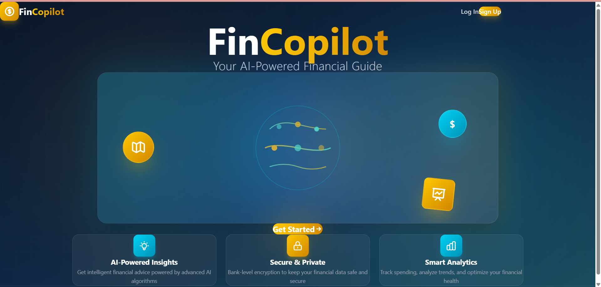

# Hi, I'm Hongirana U 👋

### Senior Full Stack Developer | MERN Stack | Fintech | AI Integration

🏢 5+ years at **Infosys Finacle** (Core Banking Platform)
🚀 Building AI-powered fintech products from scratch
📍 Bangalore, India | Open to Full-Time Roles (March 2026)

---

## 🛠️ Tech Stack

**Frontend:** React.js · Tailwind CSS · Vite · React Router  
**Backend:** Node.js · Express.js · REST APIs · JWT Auth  
**Databases:** PostgreSQL · MongoDB · Redis · Prisma ORM  
**AI/ML:** Google Gemini API · OpenAI GPT-4  
**Testing:** Jest · Artillery · Integration Testing  
**DevOps:** Vercel · Render · GitHub CI/CD  

---

## 🚀 Featured Projects

### 💰 [FinCopilot](https://github.com/Hongirana/FinCopilot) — AI-Powered Personal Finance Manager
> Production deployed fintech SaaS app built in 8 weeks

- 🤖 Dual AI integration (GPT-4 + Gemini) for smart transaction categorization
- ⚡ 4ms response time with Redis caching | 50+ req/sec load tested
- ✅ 164 automated Jest tests — 100% passing | 50+ REST API endpoints
- 🌐 Live: [fin-copilot-fawn.vercel.app](https://fin-copilot-fawn.vercel.app)

---
## 🎯 Why I Built This
Coming from 5+ years at Infosys Finacle (core banking), I wanted to demonstrate 
that I can architect and ship a full fintech product independently — from DB schema 
design to AI integration to production deployment. Built in 8 weeks solo.

## 📊 GitHub Stats

---

## 📫 Connect with Me

